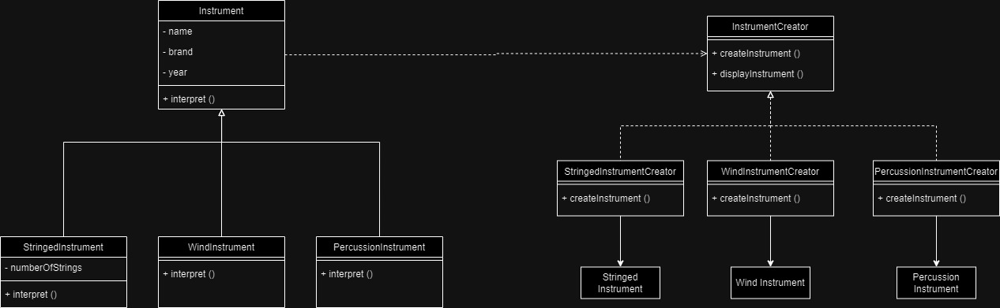

## Factory 
Made by J. Q. Pimienta and Vale Martínez

The code implements the Factory Pattern through the following class hierarchy:

- Instrument: This is the abstract base class that defines the basic properties of an instrument - name, brand, and year. It also has a mandatory method interpret() that must be implemented by concrete subclasses.
- StringedInstrument, WindInstrument, PercussionInstrument: These are concrete subclasses that inherit from the Instrument class. They implement the interpret() method specific to their instrument type (plucking a stringed instrument, blowing a wind instrument, hitting a percussion instrument).
- InstrumentCreator: This is an abstract base class that defines the createInstrument() method. This method is a factory method that must be overridden by concrete subclasses.
- StringedInstrumentCreator, WindInstrumentCreator, PercussionInstrumentCreator: These are concrete subclasses that inherit from InstrumentCreator. They implement the createInstrument() method to return a new instance of a specific concrete instrument subclass (StringedInstrument, WindInstrument, or PercussionInstrument).

Here’s how the factory pattern works in this code:

- Choosing an Instrument: The client code doesn't directly instantiate the concrete instrument classes. Instead, it creates instances of a concrete creator class (e.g., StringedInstrumentCreator).
- Factory Method: When the client calls the displayInstrument() method on the creator class, the creator class’s createInstrument() method is invoked. This method is overridden in the concrete creator subclasses to return the desired concrete instrument class.
- Concrete Instrument:  The createInstrument() method of the concrete creator class returns a new instance of the corresponding concrete instrument subclass.
- Playing the Instrument: Once the concrete instrument object is created, the client code can call the interpret() method on the instrument object to play it (which calls the specific implementation depending on the instrument type).

In essence, the Factory Pattern allows the code to hide the logic of creating specific instrument objects behind a factory class.

 This class diagram showcases the example of the Factory Method design pattern for creating musical instruments.

